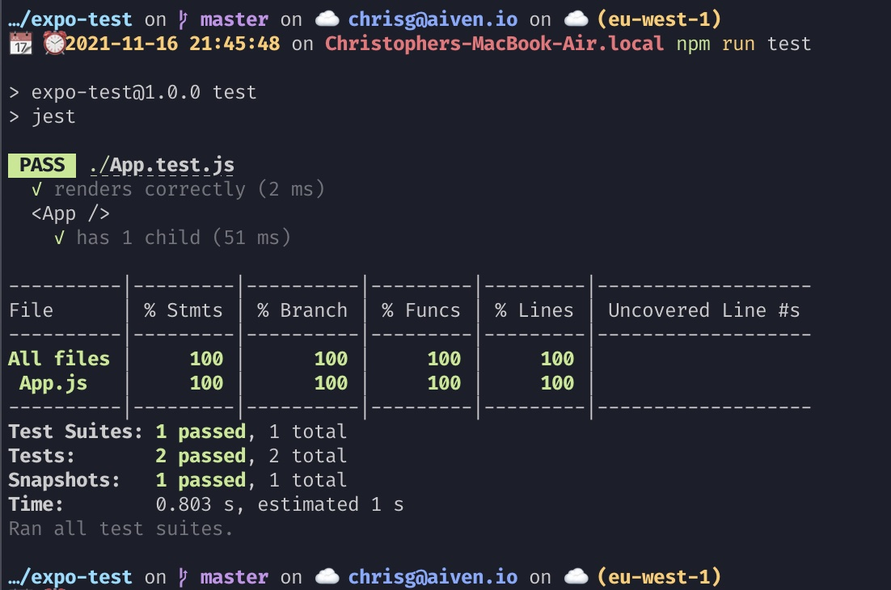

## Expo Test App

Using React Native, Expo and Jest, we can test our application with Unit, Snapshoit and End-to-end tests

### Running

You can run the tests with `npm run test` and see output like the following:

The app is quite simple, with a main screen and a trivial `ExampleComponent`; each has an associated `.test.js` file that creates some simple tests to check the rendering of the component using snapshots and the functionality of the component by checking the props.

More information on testing with Expo can be found in their [docs](https://docs.expo.dev/guides/testing-with-jest/)